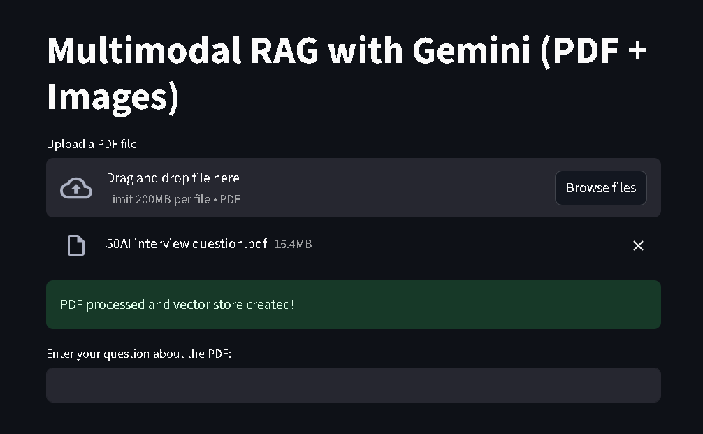
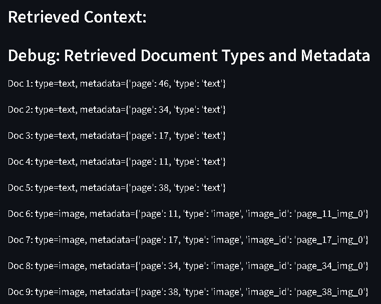
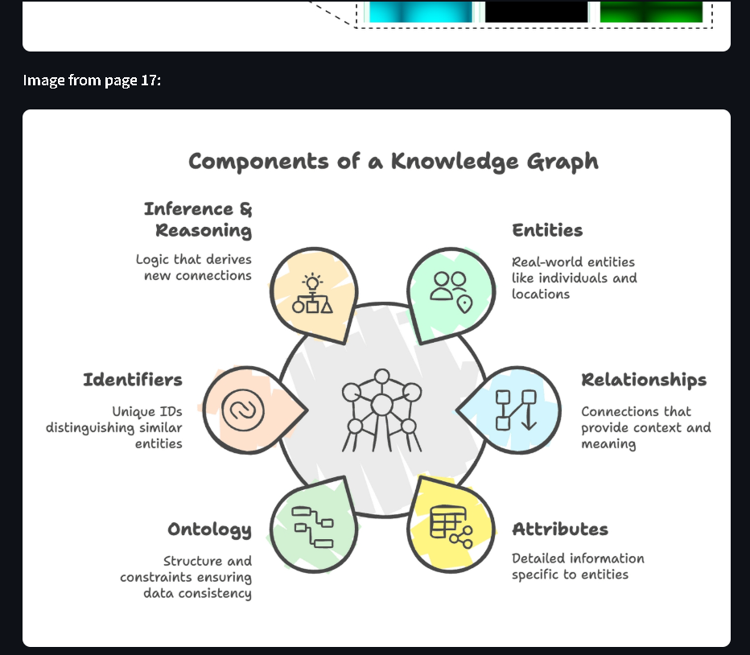
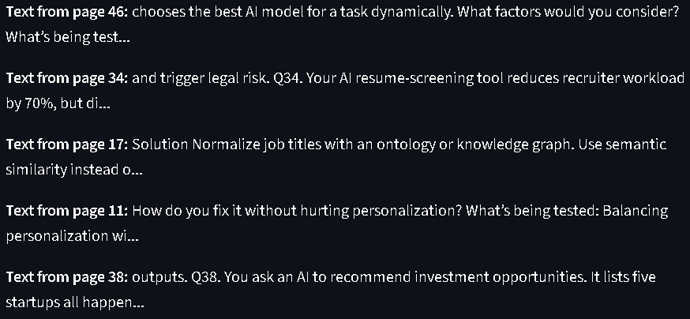
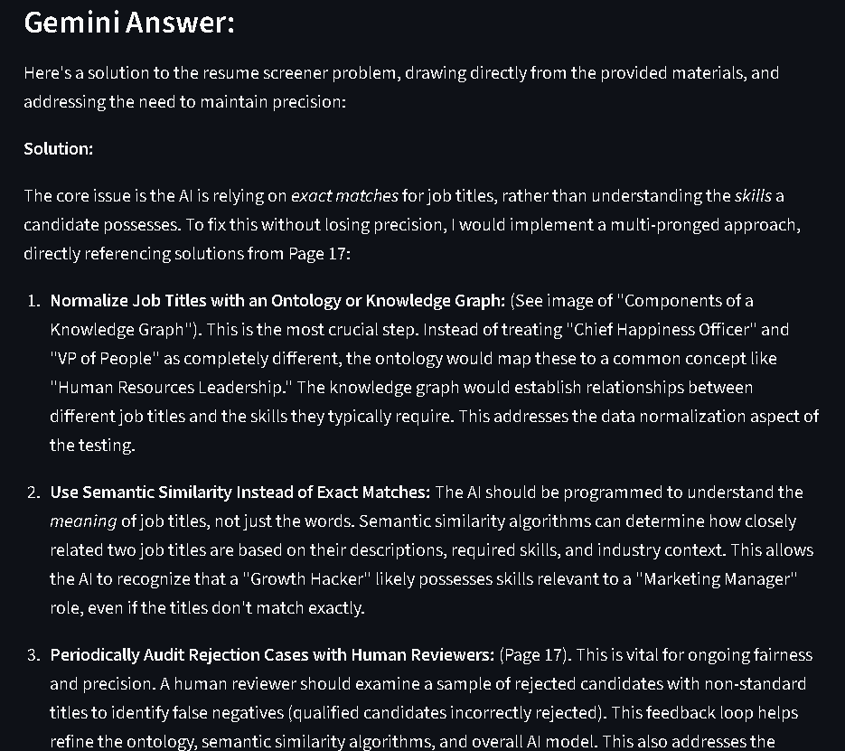

# Multi-Model RAG with Gemini and Streamlit

This project demonstrates a Multimodal Retrieval-Augmented Generation (RAG) pipeline using Google's Gemini API, CLIP embeddings, and Streamlit. The app allows you to upload a PDF, ask questions, and receive answers with both text and image context from the document.

## Demo Screenshots


Below are screenshots demonstrating the app in action:

<table>
	<tr>
		<td></td>
		<td></td>
	</tr>
	<tr>
		<td></td>
		<td></td>
	</tr>
	<tr>
		<td></td>
		<td></td>
	</tr>
</table>

## Features
- Upload any PDF and extract both text and images
- Unified embedding of text and images using OpenAI CLIP
- Fast similarity search with FAISS vector store
- Multimodal context retrieval (text + images)
- Gemini API for answer generation
- Inline image and text preview in the Streamlit UI

## Requirements
- Python 3.8+
- Streamlit
- fitz (PyMuPDF)
- Pillow
- numpy
- torch
- transformers
- langchain, langchain-core, langchain-community
- scikit-learn
- google-generativeai
- requests

Install all dependencies with uv package manager:

```sh
uv add -r requirements.txt
```

Or, if using pip:

```sh
pip install -r requirements.txt
```

## Setup
1. **Obtain a Gemini API Key:**
	- Sign up at https://ai.google.dev/ and get your API key.
2. **Set the API Key:**
	- Set the environment variable `GEMINI_API_KEY` with your Gemini API key.
	- On Windows PowerShell:
	  ```pwsh
	  $env:GEMINI_API_KEY = "your_api_key_here"
	  ```
	- Or create a `.env` file and load it in your app.

## Usage
1. Start the Streamlit app:
	```sh
	streamlit run app.py
	```
2. Upload a PDF file in the web UI.
3. Enter your question about the PDF.
4. View the retrieved context (text and images) and Gemini's answer inline.

## File Structure
- `app.py` — Main Streamlit application
- `requirements.txt` — Python dependencies
- `main.py` — (Sample entry point, not used in Streamlit app)
- `multimodelgemini.ipynb` —  Gemini-based notebook
- `image.png` — Sample image (for testing)
- `multimodelopenai.ipynb` —  openai-based notebook

## Notes

### About CLIP

**CLIP (Contrastive Language–Image Pretraining)** is a powerful multimodal model developed by OpenAI that learns visual concepts from natural language supervision. It can embed both images and text into a shared vector space, enabling unified retrieval and comparison of text and images. In this project, CLIP is used to generate embeddings for both the text and images extracted from your PDF, allowing for seamless multimodal retrieval.

#### CLIP Model
- The CLIP model used here is `openai/clip-vit-base-patch32`, a Vision Transformer (ViT) based architecture.
- It is loaded via HuggingFace Transformers, which provides pre-trained weights and easy integration.
- The model can encode both images and text, producing comparable embeddings for each.

#### CLIP Preprocessor
- The `CLIPProcessor` is a utility from HuggingFace Transformers that handles all necessary preprocessing for both images and text before passing them to the CLIP model.
- For images, it resizes, normalizes, and converts them to tensors as required by the model.
- For text, it tokenizes, pads, and truncates input to fit the model's requirements (max 77 tokens for CLIP).
- This ensures that both modalities are processed in a way that the model can understand and embed them into the same space.

#### Extension and Usage

#### Extension and Usage

- The CLIP model and processor are provided by the `transformers` Python package (HuggingFace Transformers library).
- You can extend or swap the model for other CLIP variants available on HuggingFace if needed.

**Initialization Example:**

```python
from transformers import CLIPProcessor, CLIPModel
clip_model = CLIPModel.from_pretrained("openai/clip-vit-base-patch32")
clip_processor = CLIPProcessor.from_pretrained("openai/clip-vit-base-patch32")
```

- These are then used to embed both text and images for unified retrieval.

For more details, see the official Hugging Face CLIP documentation:  
[CLIPProcessor & CLIPModel Usage](https://huggingface.co/docs/transformers/model_doc/clip?usage=Pipeline#transformers.CLIPProcessor)

All processing is done locally except for Gemini API calls.  
For best results, use PDFs with both text and images.

## License
MIT
